# System Architecture & Technical Design Document

## 1. Executive Summary & Problem Statement

The **NYC Taxi Batch ELT Data Platform** is an enterprise-grade, batch-oriented data platform designed to process, cleanse, model, and serve multi-million record monthly transportation datasets from the **New York City Taxi & Limousine Commission (TLC)**.

### The Problem
Raw transportation telemetry data exhibits high degrees of real-world noise:
* Negative fares and zero distances (disputes, cancellations, driver meter glitches).
* Timestamps where dropoff precedes pickup.
* Extreme outlier distances (>100 miles) and durations (>24 hours).
* Exact duplicate rows emitted by upstream TLC ingestion systems.
* Raw unstructured formats unsuitable for low-latency ad-hoc business intelligence queries.

### The Solution
A resilient, modern ELT architecture that separates **heavy distributed computation** (PySpark) from **vectorized analytical modeling** (DuckDB + dbt), governed by **automated orchestration** (Airflow) and verified via **continuous integration** (GitHub Actions).

---

## 2. High-Level Architecture Diagram

```mermaid
flowchart TD
    subgraph S1["1. INGESTION LAYER"]
        TLC["NYC TLC Public S3\n(Monthly Parquet + Zone CSV)"]
        Landing["Landing Zone\n(data/raw/yellow_tripdata_YYYY-MM.parquet)"]
        TLC -->|"Streaming HTTP\nIdempotent Download"| Landing
    end

    subgraph S2["2. DISTRIBUTED PROCESSING (PySpark)"]
        SparkEngine["PySpark Engine"]
        CleanseRules["Quality Rules:\n• Duration: 1 min - 24 hrs\n• Distance: 0.1 - 100 mi\n• Fare: > $0, Total > $0\n• Speed: <= 65 mph\n• Metrics: duration, speed, tip %"]
        CleanParquet["Processed Parquet\n(data/processed/yellow_tripdata_YYYY-MM_clean.parquet)"]
        Landing --> SparkEngine
        CleanseRules -.-> SparkEngine
        SparkEngine -->|"Partitioned Output"| CleanParquet
    end

    subgraph S3["3. ANALYTICAL WAREHOUSE (DuckDB)"]
        DuckEngine["DuckDB OLAP Engine\n(Columnar Vectorized SIMD)"]
        RawSchema[("Schema: raw\n• raw.trips\n• raw.zones")]
        CleanParquet -->|"Zero-Copy read_parquet()"| RawSchema
    end

    subgraph S4["4. DIMENSIONAL MODELING (dbt-duckdb)"]
        Staging["Staging (Views)\n• stg_trips (ROW_NUMBER dedup)\n• stg_zones"]
        Intermediate["Intermediate (Tables)\n• int_trips_enriched (Borough joins,\nweekend flags, day segments)"]
        Marts["Marts (Star Schema Tables)\n• fct_trips\n• dim_zones\n• dim_date"]
        RawSchema --> Staging
        Staging --> Intermediate
        Intermediate --> Marts
    end

    subgraph S5["5. ORCHESTRATION & MONITORING"]
        Airflow["Apache Airflow DAG\n(Monthly Schedule: 0 4 1 * *)"]
        Runner["Local CLI Runner\n(run_pipeline.py)"]
        Airflow -.->|"Orchestrates"| S1
        Airflow -.->|"Orchestrates"| S2
        Airflow -.->|"Orchestrates"| S3
        Airflow -.->|"Orchestrates"| S4
    end

    subgraph S6["6. CONTINUOUS INTEGRATION (GitHub Actions)"]
        GH["GitHub Actions Runner"]
        Linter["Ruff Static Analysis"]
        Pytest["Pytest Unit Tests (9)"]
        Seed["CI Synthetic Warehouse Seed"]
        DbtTest["dbt Test Suite (40 Contracts)"]
        GH --> Linter --> Pytest --> Seed --> DbtTest
    end
```



---

## 3. Data Flow & Layer Specifications

### Layer 1: Extraction & Landing (`src/extract/`)
* **Source:** Official NYC TLC CloudFront/S3 distribution endpoint.
* **Format:** Apache Parquet (Snappy compressed columnar).
* **Guarantees:**
  * **Idempotency:** Checks local filesystem before initiating HTTP downloads.
  * **Network Resilience:** Chunked streaming (8 KB chunks) with `requests` to prevent local RAM spikes.
  * **Validation:** Validates HTTP status codes and raises explicit errors on 404/missing releases.

### Layer 2: Distributed Cleansing (`src/transform/clean_taxi_data.py`)
* **Engine:** Apache Spark (PySpark 3.5+).
* **Role:** High-throughput outlier elimination, schema coercion, and operational metrics enrichment.
* **Applied Business Filters:**
  $$\text{trip\_duration\_minutes} \in [1.0, 1440.0]$$
  $$\text{trip\_distance} \in (0.0, 100.0]$$
  $$\text{fare\_amount} > 0.0 \quad \land \quad \text{total\_amount} > 0.0$$
  $$\text{passenger\_count} > 0$$
  $$\text{avg\_speed\_mph} \le 65.0$$
* **Derived Engineered Features:**
  * `trip_duration_minutes`: Dropoff epoch minus pickup epoch divided by 60.
  * `avg_speed_mph`: Calculated from distance and duration.
  * `tip_percentage`: $(tip\_amount / fare\_amount) \times 100$, with zero-fare guardrails.

### Layer 3: Analytical Storage (`src/load/load_to_duckdb.py`)
* **Engine:** DuckDB (`nyc_taxi.duckdb`).
* **Design:**
  * Dedicated logical schemas (`raw`, `staging`, `intermediate`, `marts`).
  * Direct zero-copy scanning via `read_parquet()` and `read_csv_auto()`.
  * Multi-threaded columnar storage with automatic dictionary encoding and bitpacking.

### Layer 4: Dimensional Modeling (`nyc_taxi_dbt/`)
Adheres to the Kimball Star Schema methodology:

```
                  ┌──────────────────────┐
                  │    dim_zones         │
                  ├──────────────────────┤
             ┌───►│ PK  location_id      │
             │    │     borough          │
             │    │     zone_name        │
             │    │     service_zone     │
             │    └──────────────────────┘
             │
┌────────────┴─────────────┐         ┌──────────────────────┐
│       fct_trips          │         │      dim_date        │
├──────────────────────────┤         ├──────────────────────┤
│ PK  trip_id (MD5 hash)   │    ┌───►│ PK  date_day         │
│ FK  pickup_location_id   │────┘    │     year             │
│ FK  dropoff_location_id  │         │     month            │
│ FK  pickup_date          │─────────┘     quarter          │
│     vendor_id            │               day_of_week_name │
│     pickup_at            │               is_weekend       │
│     dropoff_at           │         └──────────────────────┘
│     trip_distance_miles  │
│     trip_duration_minutes│
│     fare_amount          │
│     tip_amount           │
│     total_amount         │
│     payment_method       │
│     time_of_day_segment  │
└──────────────────────────┘
```

1. **`staging` (Materialized as Views):**
   * Renames TLC source columns into standardized analytical naming conventions.
   * Eliminates duplicate source records via `ROW_NUMBER() OVER (PARTITION BY VendorID, pickup, dropoff, PULocation, DOLocation, total_amount, passenger_count)`.
   * Computes surrogate MD5 `trip_id` hash.
2. **`intermediate` (Materialized as Tables):**
   * Enriches trips with lookup joins for pickup/dropoff borough and service zone names.
   * Categorizes temporal dimensions (`Morning Rush`, `Midday`, `Evening Rush`, `Night`, `Late Night`).
   * Computes `is_weekend` flags.
3. **`marts` (Materialized as Tables):**
   * `fct_trips`: Fact table partitioned analytically for aggregated BI queries.
   * `dim_zones`: Location dimension mapping taxi zone IDs to boroughs and zones.
   * `dim_date`: Date dimension generated via DuckDB `GENERATE_SERIES` spanning 2024–2025.

---

## 4. Architectural Decision Records (ADRs)

### ADR-01: DuckDB as the Analytical OLAP Engine
* **Context:** The initial specification recommended cloud-managed Snowflake.
* **Decision:** Replaced Snowflake with DuckDB.
* **Rationale:**
  1. **Zero Operating Cost:** DuckDB runs out-of-process in local compute without monthly cloud warehouse bills or credit consumption.
  2. **Vectorized SIMD Processing:** DuckDB operates on vectorized row batches using CPU cache lines, executing queries across 2.85M rows in under 200ms.
  3. **Zero-Copy Ingestion:** Scans Parquet directly from disk without serializing data through external network APIs.
  4. **CI/CD Friendly:** Can be created, seeded, tested, and destroyed in GitHub Actions runners in <3 seconds without needing cloud service account keys or network secrets.

### ADR-02: PySpark for Cleansing vs. Pure In-Warehouse SQL
* **Context:** Transforming raw Parquet can be done inside SQL engines or distributed compute engines.
* **Decision:** Implemented PySpark for Bronze-to-Silver cleansing.
* **Rationale:**
  1. **Memory Isolation:** PySpark's memory manager prevents out-of-memory (OOM) failures when processing large monthly or multi-month historical datasets (50M+ rows).
  2. **Decoupled Architecture:** Follows enterprise medallion architecture: data lake cleansing (PySpark) outputting clean Parquet, which is then loaded into the warehouse (DuckDB).
  3. **Industry Standard Practice:** Matches real-world production environments where Spark is used for heavy ETL workloads upstream of analytical warehouses.

### ADR-03: dbt for Data Modeling vs. Ad-Hoc Scripts
* **Context:** Transformations can be written as SQL strings inside Python scripts.
* **Decision:** Utilized dbt (`dbt-duckdb`).
* **Rationale:**
  1. **Lineage & Dependency DAG:** Automatically manages table creation order based on `ref()` dependencies.
  2. **Automated Testing:** 40 automated tests run as part of the pipeline contract.
  3. **Self-Documenting:** Produces an interactive catalog and schema dictionary.

---

## 5. Data Contract & Quality Framework

Data reliability is enforced at two distinct validation boundaries:

### Boundary 1: Distributed Data Cleansing Boundary (PySpark)
* Rejects physical impossibilities before warehouse insertion.
* Emits validation audit metrics (`initial_rows`, `clean_rows`, `dropped_rows`, `dropped_percentage`).
* January 2024 results: **2,964,624 raw records** ingested $\rightarrow$ **105,359 anomalous records rejected** (3.55%) $\rightarrow$ **2,859,265 clean records landed**.

### Boundary 2: Warehouse Data Contract Boundary (dbt Test Suite)
The pipeline enforces **40 automated tests** across 4 categories:

| Category | Target Models | Rules Enforced |
|---|---|---|
| **Uniqueness** | `stg_trips`, `int_trips_enriched`, `fct_trips`, `dim_zones` | MD5 surrogate `trip_id` and integer `location_id` are strictly unique. |
| **Completeness** | All models | Critical columns (`pickup_at`, `dropoff_at`, `fare_amount`, `payment_method`, etc.) are NOT NULL. |
| **Referential Integrity** | `fct_trips` $\rightarrow$ `dim_zones` | Every `pickup_location_id` and `dropoff_location_id` must resolve to a valid zone in `dim_zones`. |
| **Domain Logic** | `fct_trips`, `int_trips_enriched` | `pickup_at` precedes `dropoff_at`; fare, distance, and duration metrics are $> 0$; payment methods conform to enum dictionary. |

---

## 6. Continuous Integration & Delivery (CI/CD)

The GitHub Actions pipeline (`.github/workflows/ci.yml`) runs on every commit:
1. **Linting:** `ruff check .` validates PEP 8 compliance, sorting, and syntax.
2. **Unit Tests:** `pytest -v tests/` executes 9 unit tests verifying isolated modules.
3. **Synthetic Database Seeding:** Generates a compliant 265-zone, 100-trip DuckDB warehouse in <1s.
4. **dbt Dependency Resolution:** `dbt deps` pulls required package dependencies (`dbt_utils`).
5. **Model Build:** `dbt run` compiles and builds all 7 views and tables.
6. **Contract Testing:** `dbt test` validates all 40 assertions against the database.
